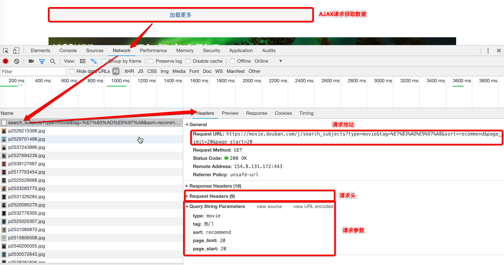

   * [豆瓣电影](#豆瓣电影)
      * [1. 分析](#1-分析)
         * [分析流程图](#分析流程图)
         * [分析结果](#分析结果)
         * [代码实现流程分析](#代码实现流程分析)
         * [具体代码](#具体代码)

# 豆瓣电影
## 1. 分析
### 分析流程图

### 分析结果
- 结果概要

分析目标 | 分析结果
------------- | -------------
请求URL分析	| 	https://movie.douban.com/j/search_subjects
请求方式分析 | GET
请求参数分析 | 上图中所示请求参数
请求头分析 | 上图中请求头

- 注意:

> 请求头一般都是先放``User-Agent``，如果爬取失败再补``Referer``，还是失败就再补``Cookie``，如果喜欢稳一点的，可以每次都加上

- 请求参数分析

参数KEY | 分析结果
------------- | -------------
type	| 	movie（固定值不变）
tag | 热门（固定值不变）
sort | recommend（固定值不变）
page_limit | 20（固定值不变，表示每页数量）
page_start | 0（每次请求发生变化，每20页进行叠加，表示数据的偏移量）

### 代码实现流程分析
1. 先完成一次请求的抓取
2. 再完成多次请求的爬取
- 总结:

> 循序渐进养成良好的习惯

### 具体代码

[查看代码请点击此处](https://github.com/CriseLYJ/Python-crawler-tutorial-starts-from-zero/blob/master/code_demo/douban.py)
 