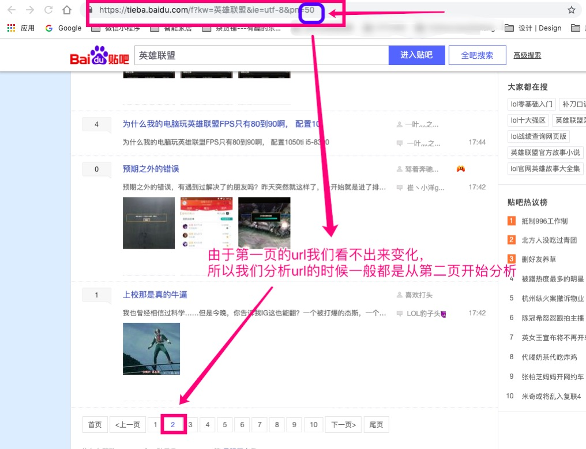

   * [百度贴吧爬虫](#百度贴吧爬虫)
      * [分析](#分析)
         * [分析流程图](#分析流程图)
         * [分析结果](#分析结果)
            * [结果概要](#结果概要)
         * [代码实现流程](#代码实现流程)
      * [代码实现](#代码实现)

# 百度贴吧爬虫
## 分析
### 分析流程图

> 分析 ``url`` 的时候我们一般都是从第二页开始分析，可以看出 ``url`` 的变化



### 分析结果
#### 结果概要

| 请求目标                           | 分析结果            |
|-----------------------------------|-------------------|
| 请求方式分析                        | GET                                 |
| 请求参数分析                        | pn每页50发生变化，其他参数固定不变       |
| 请求头分析                          | 只需要添加User-Agent                  |
| 请求url分析                         | https://tieba.baidu.com/f?kw=英雄联盟&ie=utf-8&pn=50 

### 代码实现流程
1. 实现面向对象构建爬虫对象
2. 爬虫流程四步骤
	1. 获取 url 列表
	2. 发送请求获取响应
	3. 从响应中提取数据
	4. 保存数据


## 代码实现

[详细代码请点击](https://github.com/CriseLYJ/Python-crawler-tutorial-starts-from-zero/blob/master/code_demo/Tieba.py)

```python
#!/usr/bin/python3
# -*- coding: utf-8 -*-
import requests

class TiebaSpider():

    def __init__(self,kw,max_pn):
        self.max_pn = max_pn
        self.kw = kw
        self.base_url = "https://tieba.baidu.com/f?kw={}&ie=utf-8&pn={}"
        self.headers = {
            "User-Agent": "Mozilla/5.0 (Macintosh; Intel Mac OS X 10_14_0) AppleWebKit/537.36 (KHTML, like Gecko) Chrome/70.0.3538.110 Safari/537.36"
        }
        pass

    def get_url_list(self):
        '''
        获取 url 列表
        :return: 
        '''
        # 写法一
        '''
        url_list = []

        for pn in range(0,self.max_pn,50):
            url = self.base_url.format(self.kw,pn)
            url_list.append(url)

        return url_list
        '''
        # 写法二
        return [self.base_url.format(self.kw,pn) for pn in range(0,self.max_pn,50)]

    def get_content(self,url):
        '''
        发送请求获取响应内容
        :param url: 
        :return: 
        '''
        response = requests.get(
            url=url,
            headers = self.headers
        )

        return response.content

    def get_items(self,content,idx):
        '''
        从响应内容中提取数据
        :param content: 
        :return: 
        '''
        with open('08-{}.html'.format(idx),'wb') as f:
            f.write(content)
        return None

    def save_items(self,items):
        '''
        保存数据
        :param items: 
        :return: 
        '''
        pass


    def run(self):

        # 1. 获取 url 列表
        url_list = self.get_url_list()

        for url in url_list:
            # 2. 发送请求获取响应
            content = self.get_content(url)

            # 3. 从响应中提取数据
            items = self.get_items(content,url_list.index(url) + 1)

            # 4. 保存数据
            self.save_items(items)

        pass

if __name__ == '__main__':
    spider = TiebaSpider("英雄联盟",150)
    spider.run()
```