   * [百度翻译爬虫](#百度翻译爬虫)
      * [分析](#分析)
         * [分析流程](#分析流程)
         * [分析结果](#分析结果)
            * [请求参数分析](#请求参数分析)
         * [JS 逆向流程](#js-逆向流程)
            * [chrome 调试技巧](#chrome-调试技巧)
               * [JS 逆向流程](#js-逆向流程-1)
            * [根据逆向流程查找我们所需的js代码](#根据逆向流程查找我们所需的js代码)
         * [编写爬虫代码](#编写爬虫代码)
            * [注意](#注意)
            * [最后](#最后)
         * [<a href="https://github.com/CriseLYJ/awesome-python-login-model/tree/master/baidu_translate">完整代码</a>](#完整代码)

# 百度翻译爬虫
## 分析
- 打开百度翻译

> url : https://fanyi.baidu.com/#en/zh/

### 分析流程

1. 将浏览器切换至手机端，这样查看请求的参数可能会较少，点击下图中的按钮：

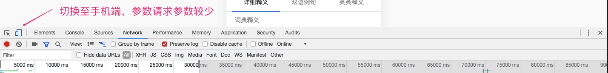

2. 查看请求接口

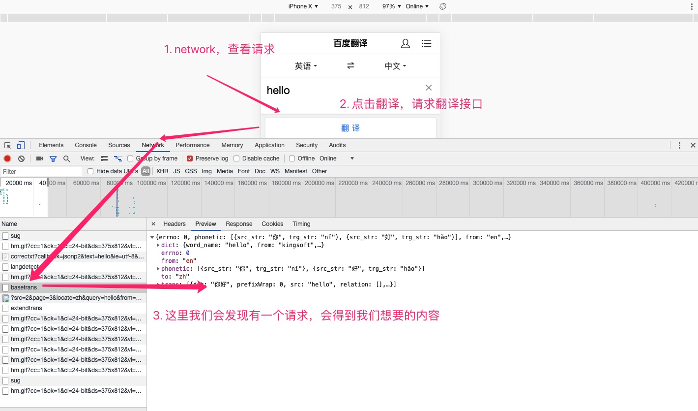

3. 查看请求参数是否有变化
- 图一：
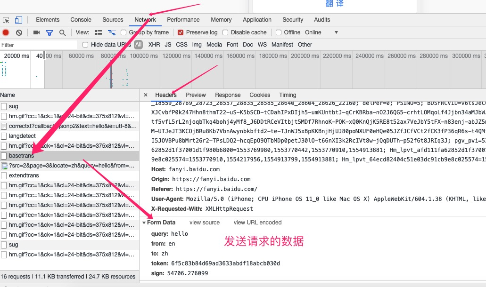

- 图二：
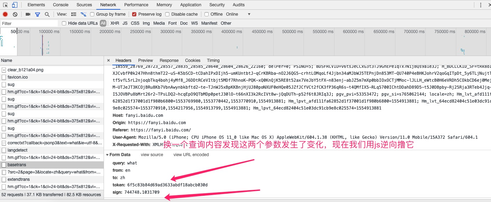

> 经过分析，我们发现这里有两个参数发生变化，经过推断，这里的参数可能是使用js生成的，所以我们这里要对接口进行分析，破解，得到这里的值

### 分析结果
|--分析目标---|----分析结果-------------------|
-------------|-------------------------------|
|请求URL分析	   |https://fanyi.baidu.com/basetrans|
|请求方式分析	| POST  |
|请求参数分析 | 	参看请求参数分析|
|请求头分析 |	参看请求头分析|

#### 请求参数分析

参数KEY	|分析结果
-------|-------
| query|	翻译单词（变化）|
|from	|en（固定值不变）|
|to	 |zh（固定值不变）|
|token | 6f5c83b84d69ad3633abdf18abcb030d（经过请求测试，我们发现可以为固定值）|
|sign |54706.276099|

### JS 逆向流程

> 注意： 在js逆向中，不是你要精通js才可以js逆向，你要懂一点js就可以做逆向，重要的逆向思维，对问题的思考方式

#### chrome 调试技巧

1. search 打开查询面板
2. 查询面板可以通过关键字查找所有出现关键字地方的代码
3. 点击跟踪代码并且可以把代码格式化
4. 对格式化的代码进行设置断点
5. 鼠标光标移动到上面可以查看当前运行代码变量值，函数原始代码地方等等

##### JS 逆向流程

1. 通过关键词切入到代码中，切入到发送请求的代码行，通过请求的url中提取关键字
2. 在发送请求的代码添加断点，并且触发发送请求，确认寻找的代码是否正确
3. 往上逆向，寻找目标参数以及生成逻辑
4. 利用js2py模拟执行生成逻辑获取想要的内容


#### 根据逆向流程查找我们所需的js代码

1. 搜索关键字

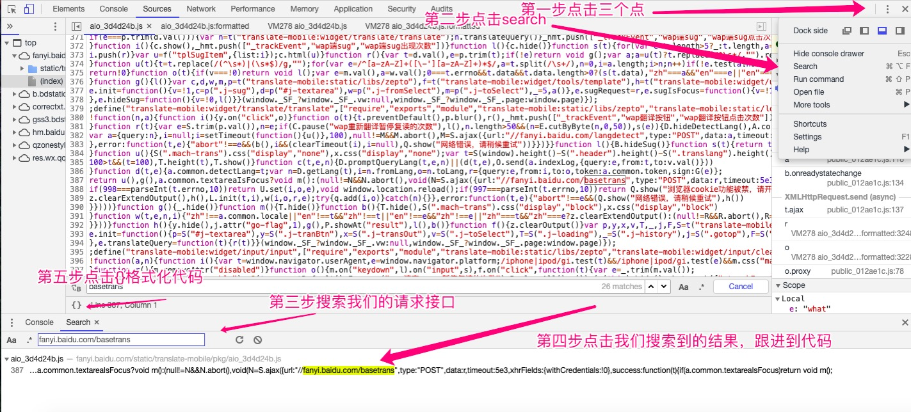

2. 跟进代码，分析AJAX请求

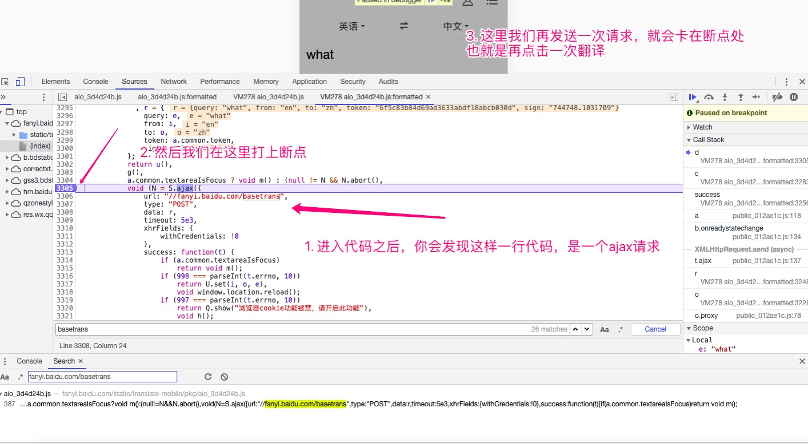

3. 查找我们需要的值

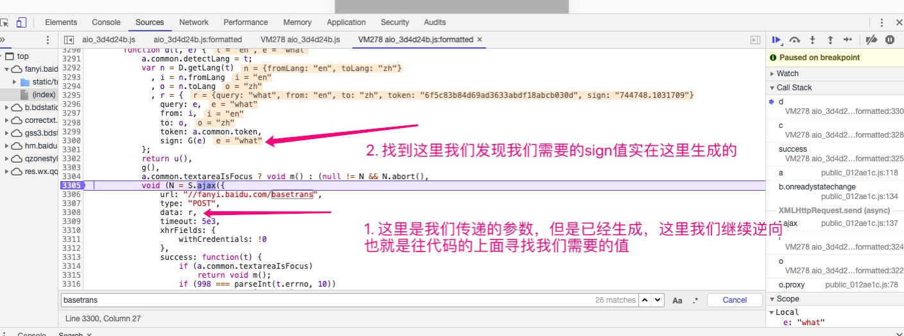

- 准确的找到我们需要的值

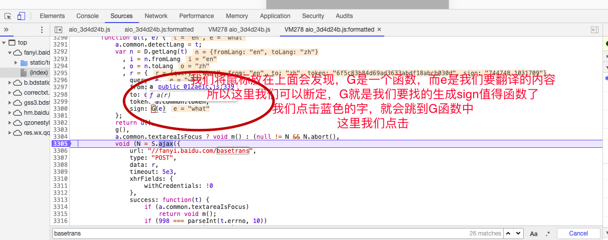

- 复制我们需要的js代码

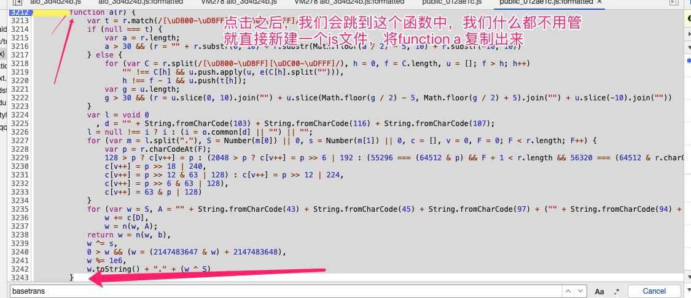

- 代码如下：

```javascript
        function a(r) {
            var t = r.match(/[\uD800-\uDBFF][\uDC00-\uDFFF]/g);
            if (null === t) {
                var a = r.length;
                a > 30 && (r = "" + r.substr(0, 10) + r.substr(Math.floor(a / 2) - 5, 10) + r.substr(-10, 10))
            } else {
                for (var C = r.split(/[\uD800-\uDBFF][\uDC00-\uDFFF]/), h = 0, f = C.length, u = []; f > h; h++)
                    "" !== C[h] && u.push.apply(u, e(C[h].split(""))),
                    h !== f - 1 && u.push(t[h]);
                var g = u.length;
                g > 30 && (r = u.slice(0, 10).join("") + u.slice(Math.floor(g / 2) - 5, Math.floor(g / 2) + 5).join("") + u.slice(-10).join(""))
            }
            var l = void 0
              , d = "" + String.fromCharCode(103) + String.fromCharCode(116) + String.fromCharCode(107);
            l = null !== i ? i : (i = o.common[d] || "") || "";
            for (var m = l.split("."), S = Number(m[0]) || 0, s = Number(m[1]) || 0, c = [], v = 0, F = 0; F < r.length; F++) {
                var p = r.charCodeAt(F);
                128 > p ? c[v++] = p : (2048 > p ? c[v++] = p >> 6 | 192 : (55296 === (64512 & p) && F + 1 < r.length && 56320 === (64512 & r.charCodeAt(F + 1)) ? (p = 65536 + ((1023 & p) << 10) + (1023 & r.charCodeAt(++F)),
                c[v++] = p >> 18 | 240,
                c[v++] = p >> 12 & 63 | 128) : c[v++] = p >> 12 | 224,
                c[v++] = p >> 6 & 63 | 128),
                c[v++] = 63 & p | 128)
            }
            for (var w = S, A = "" + String.fromCharCode(43) + String.fromCharCode(45) + String.fromCharCode(97) + ("" + String.fromCharCode(94) + String.fromCharCode(43) + String.fromCharCode(54)), b = "" + String.fromCharCode(43) + String.fromCharCode(45) + String.fromCharCode(51) + ("" + String.fromCharCode(94) + String.fromCharCode(43) + String.fromCharCode(98)) + ("" + String.fromCharCode(43) + String.fromCharCode(45) + String.fromCharCode(102)), D = 0; D < c.length; D++)
                w += c[D],
                w = n(w, A);
            return w = n(w, b),
            w ^= s,
            0 > w && (w = (2147483647 & w) + 2147483648),
            w %= 1e6,
            w.toString() + "." + (w ^ S)
        }
```

### 编写爬虫代码
- 写代码之前，我们需要先了解一下 ``js2py`` 这个模块
- ``js2py`` 模块的使用我会放在主要教程中，接下来我们就不浪费时间了，直接开始。

```python
import requests
import js2py

context = js2py.EvalJs()


class BaiDuTranslater(object):
    """
    百度翻译爬虫
    """

    def __init__(self, query):
        # 初始化
        self.url = "https://fanyi.baidu.com/basetrans"
        self.query = query
        self.headers = {
            "User-Agent": "Mozilla/5.0 (iPhone; CPU iPhone OS 11_0 like Mac OS X) AppleWebKit/604.1.38 (KHTML, like Gecko) Version/11.0 Mobile/15A372 Safari/604.1",
            "Referer": "https://fanyi.baidu.com/",
            "Cookie": "BAIDUID=714BFAAF02DA927F583935C7A354949A:FG=1; BIDUPSID=714BFAAF02DA927F583935C7A354949A; PSTM=1553390486; delPer=0; PSINO=5; H_PS_PSSID=28742_1463_21125_18559_28723_28557_28697_28585_28640_28604_28626_22160; locale=zh; from_lang_often=%5B%7B%22value%22%3A%22en%22%2C%22text%22%3A%22%u82F1%u8BED%22%7D%2C%7B%22value%22%3A%22zh%22%2C%22text%22%3A%22%u4E2D%u6587%22%7D%5D; to_lang_often=%5B%7B%22value%22%3A%22en%22%2C%22text%22%3A%22%u82F1%u8BED%22%7D%2C%7B%22value%22%3A%22zh%22%2C%22text%22%3A%22%u4E2D%u6587%22%7D%5D; REALTIME_TRANS_SWITCH=1; FANYI_WORD_SWITCH=1; HISTORY_SWITCH=1; SOUND_SPD_SWITCH=1; SOUND_PREFER_SWITCH=1; Hm_lvt_afd111fa62852d1f37001d1f980b6800=1553658863,1553766321,1553769980,1553770442; Hm_lpvt_afd111fa62852d1f37001d1f980b6800=1553770442; Hm_lvt_64ecd82404c51e03dc91cb9e8c025574=1553766258,1553766321,1553769980,1553770442; Hm_lpvt_64ecd82404c51e03dc91cb9e8c025574=1553770442"
        }

    def make_sign(self):
        # js逆向获取sign的值
        # 读取js文件
        with open("translate.js", "r", encoding="utf-8") as f:
        	  # 添加至上下文
            context.execute(f.read())

        # 调用js中的函数生成sign
        sign = context.a(self.query)
        # 将sign加入到data中
        return sign

    def make_data(self, sign):
        data = {
            "query": self.query,
            "from": "en",
            "to": "zh",
            "token": "6f5c83b84d69ad3633abdf18abcb030d",
            "sign": sign
        }
        return data

    def get_content(self, data):
        # 发送请求获取响应
        response = requests.post(
            url=self.url,
            headers=self.headers,
            data=data
        )
        return response.json()["trans"][0]["dst"]

    def run(self):
        """运行程序"""
        # 获取sign的值
        sign = self.make_sign()
        # 构建参数
        data = self.make_data(sign)
        # 获取翻译内容
        content = self.get_content(data)
        print(content)


if __name__ == '__main__':
    query = input("请输入您要翻译的内容:")
    translater = BaiDuTranslater(query)
    translater.run()
```

#### 注意
- 此时我们运行代码会报错误，会讲我们缺少 ``r`` 的值


> 解决办法：回到浏览器，我们查找 ``r`` 的值,并将生成 ``r`` 的值的函数，加入到我们之前创建的 ``js`` 文件中，放在 `G` 函数的上面

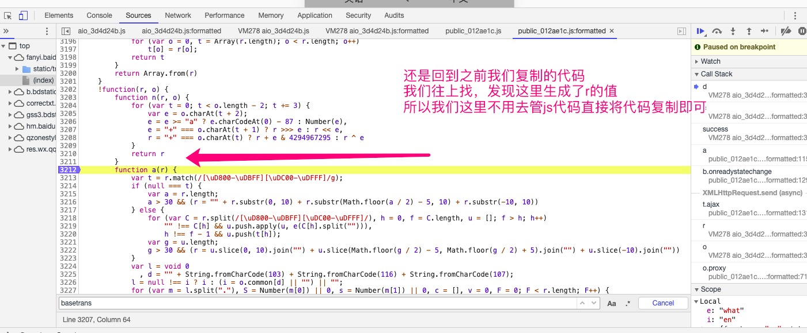

- 生成r的代码,如下所示

```javascript
function n(r, o) {
    for (var t = 0; t < o.length - 2; t += 3) {
        var e = o.charAt(t + 2);
        e = e >= "a" ? e.charCodeAt(0) - 87 : Number(e),
            e = "+" === o.charAt(t + 1) ? r >>> e : r << e,
            r = "+" === o.charAt(t) ? r + e & 4294967295 : r ^ e
    }
    return r
}
```

- 我们重新运行代码，发现又会遇到一个错误，说是缺少 ``i`` 的值，所以我们的解决办法还是，继续进行 `js` 逆向，查找i的值

- 逆向分析

1. 我们回到 `function a()`中，找到需要使用 ``i``值的地方，打上断点

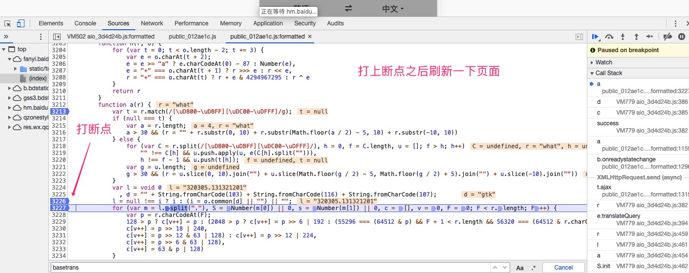

2. 打上断点之后刷新一下页面,我们再次将鼠标放在 ``i``上，我们会看到一个浮点字符串，此时我们不确定 `i` 的值是否是变化的，所以我们换一个翻译的单词，刷新页面，再次查看 `i` 的值，我们发现 `i` 的值是固定的，所以我们可以在代码中，直接定义一个固定的`i` 值.

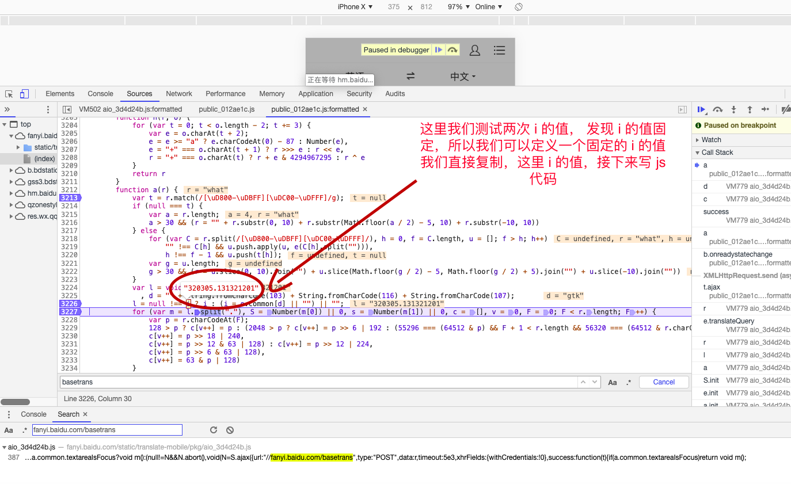

> 我们在自定义的 js 代码最上面一行写入：

```javascript
var i = "320305.131321201"
```

#### 最后

> 我们运行代码，yes 成功，这样我们就完成了一次简单的 js 逆向尝试。

### [完整代码](https://github.com/CriseLYJ/awesome-python-login-model/tree/master/baidu_translate)


