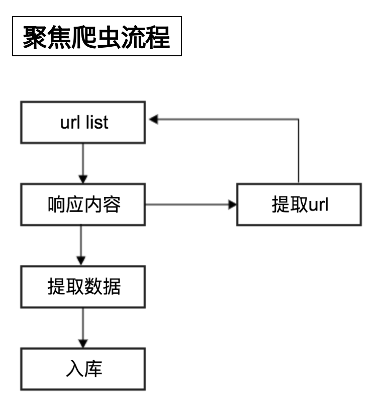
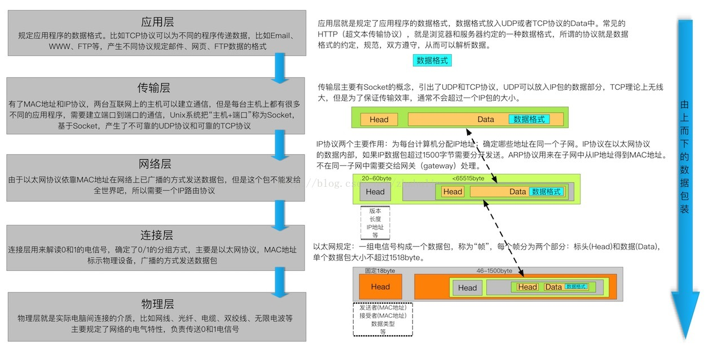
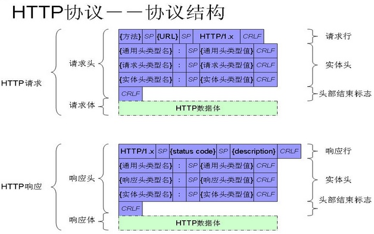
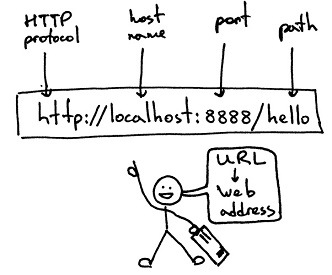
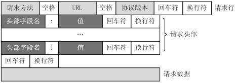
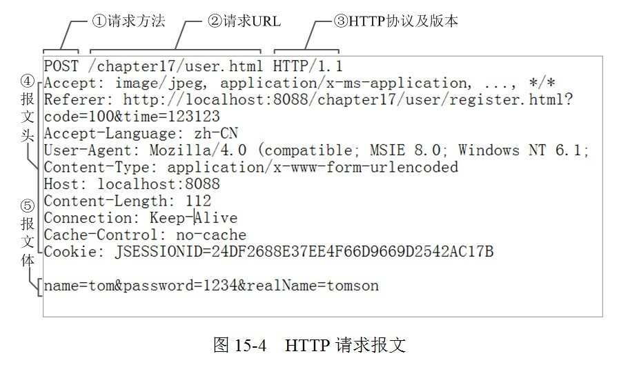
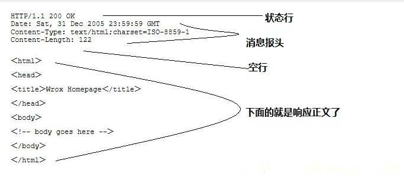

   * [爬虫预备知识](#爬虫预备知识)
      * [概要](#概要)
         * [爬虫定义、分类和流程](#爬虫定义分类和流程)
            * [爬虫定义](#爬虫定义)
            * [爬虫的分类](#爬虫的分类)
            * [爬虫的用途](#爬虫的用途)
            * [爬虫的流程](#爬虫的流程)
            * [robots 协议](#robots-协议)
         * [总结](#总结)
      * [HTTP 与 HTTPS](#http-与-https)
         * [HTTP 与 HTTPS 的概念](#http-与-https-的概念)
            * [HTTP](#http)
               * [HTTP 请求流程](#http-请求流程)
               * [五层网络模型](#五层网络模型)
               * [HTTP协议结构图](#HTTP协议结构图)
               * [网络模型对应关系](#网络模型对应关系)
               * [url 地址格式](#url-地址格式)
               * [HTTP 请求](#http-请求)
               * [HTTP 响应](#http-响应)
               * [HTTPS](#https)
               
# 爬虫预备知识
> 爬虫课程中所需要的相关知识储备

## 概要
- 爬虫``定义``、``分类``和``流程``
- ``http``和``https``

### 爬虫定义、分类和流程

#### 爬虫定义
> 网络爬虫（又被称为网页蜘蛛，网络机器人）就是模拟浏览器发送网络请求，接收请求响应，一种按照一定的规则，自动地抓取互联网信息的程序。

> 爬虫就是模拟浏览器的行为，越像越好，越像就越不容易被发现。 

> 原则上,只要是浏览器(客户端)能做的事情，爬虫都能够做。

#### 爬虫的分类
1. ``通用爬虫``：通常指搜索引擎的爬虫
2. ``聚焦爬虫``：针对特定网站的爬虫

#### 爬虫的用途
- 今日头条
- 网易云音乐
- 12306抢票
- 网站自动投票
- 短信轰炸
- 等等

#### 爬虫的流程

1. 向起始url发送请求，并获取响应
2. 对响应进行提取
3. 如果提取url，则继续发送请求获取响应
4. 如果提取数据，则将数据进行保存

#### robots 协议
> Robots 协议：网站通过 Robots 协议告诉搜索引擎哪些页面可以抓取，哪些页面不能抓取，但它仅仅是道德层面上的约束 例如：[淘宝的 robots 协议](https://www.taobao.com/robots.txt)

### 总结
- 爬虫概念：模拟浏览器发送网络请求，接收请求响应。只要是浏览器(客户端)能做的事情，爬虫都能够做。
- 爬虫的分类：聚焦爬虫、通用爬虫
- 爬虫的流程：
	1. 向起始 url 发送请求，并获取响应
	2. 对响应进行提取
	3. 如果提取 url，则继续发送请求获取响应
	4. 如果提取数据，则将数据进行保存

## HTTP 与 HTTPS

### HTTP 与 HTTPS 的概念

#### HTTP
> 概念：HTTP（超文本传输协议）是应用层上的一种客户端/服务端模型的通信协议,它由请求和响应构成，且是无状态的。
> 协议：协议规定了通信双方必须遵守的数据传输格式，这样通信双方按照约定的格式才能准确的通信。
> 无状态：无状态是指两次谅解通信之间是没有任何联系的，每次都是一个新的连接，服务端不会记录前后的请求信息。

##### HTTP 请求流程

1. 浏览器通过域名解析服务器（DNS）获取IP地址
2. 浏览器先向 IP 发起请求，并获取相应
3. 在返回的响应内容（html）中，会带有 css、js、图片等 url 地址，以及 ajax 代码，浏览器按照响应内容中的顺序依次发送其他的请求，并获取相应的响应
4. 浏览器每获取一个响应就对展示出的结果进行添加（加载），js，css 等内容会修改页面的内容，js也可以重新发送请求，获取响应
5. 从获取第一个响应并在浏览器中展示，直到最终获取全部响应，并在展示的结果中添加内容或修改————这个过程叫做浏览器的渲染

##### 五层网络模型

##### HTTP协议结构图

##### 网络模型对应关系

1. HTTP、RTSP、FTP -------> 应用层
2. TCP、UDP -------> 传输层
3. IP -------> 网络层
4. 数据链路 -------> 数据链路层
5. 物理介质 -------> 物理层

##### url 地址格式

> 格式说明： scheme://host[:port]/path/…/[?query-string][#anchor]

1. scheme：协议（例如：http, https, ftp）
2. host：服务器的 IP 地址或者域名
3. port：服务器的端口（如果是走协议默认端口，缺省端口80）
4. path：访问资源的路径
5. query-string：参数，发送给 http 服务器的数据
6. anchor：锚（跳转到网页的指定锚点位置）

#####  HTTP 请求
- 请求格式

- 案例

- **请求方式**
> 根据 HTTP 标准，HTTP 请求可以使用多种请求方法。
>
> HTTP1.0 定义了三种请求方法： GET, POST 和 HEAD 方法。
>
> HTTP1.1 新增了五种请求方法：OPTIONS, PUT, DELETE, TRACE 和 CONNECT 方法。

| 请求方式 | 描述 |
|---------|------------------------------------------------------------------------------------------------------------------------------------------|
| GET     | 请求指定的页面信息，并返回实体主体。                                                                                                     |
| HEAD    | 类似于 get 请求，只不过返回的响应中没有具体的内容，用于获取报头                                                                          |
| POST    | 向指定资源提交数据进行处理请求（例如提交表单或者上传文件）。数据被包含在请求体中。POST 请求可能会导致新的资源的建立和/或已有资源的修改。 |
| PUT     | 从客户端向服务器传送的数据取代指定的文档的内容                                                                                           |
| DELETE  | 请求服务器删除指定的页面。                                                                                                               |
| CONNECT | HTTP/1.1 协议中预留给能够将连接改为管道方式的代理服务器。                                                                                |
| OPTIONS | 允许客户端查看服务器的性能。                                                                                                             |
| TRACE   | 回显服务器收到的请求，主要用于测试或诊断。                                                                                               |

- **常见请求头**

| 请求头                            | 作用              |
|-----------------------------------|-------------------|
| **Cookie**                        | Cookie            |
| **User-Agent**                    | 浏览器名称        |
| **Referer**                       | 页面跳转处        |
| Host                              | 主机和端口号      |
| Connection                        | 链接类型          |
| Upgrade-Insecure-Requests         | 升级为 HTTPS 请求 |
| Accept                            | 传输文件类型      |
| Accept-Encoding                   | 文件编解码格式    |
| x-requested-with : XMLHttpRequest | ajax 请求         |

[点击查看更多](https://github.com/CriseLYJ/Python-crawler-tutorial-starts-from-zero/blob/master/HTTP%E8%AF%B7%E6%B1%82%E5%88%97%E8%A1%A8.md)

##### HTTP 响应

- **响应格式**

> HTTP响应也由四个部分组成，分别是：状态行、消息报头、空行（回车符 + 换行符）和响应正文。

- **响应头**

| 响应头         | 作用                                           |
|----------------|------------------------------------------------|
| **Location**   | 这个头配合 302 状态码使用，告诉用户端找谁。    |
| **Set-Cookie** | 设置和页面关联的 Cookie                        |
| Content-Type   | 服务器通过这个头，回送数据的类型               |
| Server         | 服务器通过这个头，告诉浏览器服务器的类型       |
| Content-Length | 服务器通过这个头，告诉浏览器回送数据的长度     |
| Connection     | 服务器通过这个头，响应完是保持链接还是关闭链接 |

- **HTTP 状态码**

>当浏览者访问一个网页时，浏览者的浏览器会向网页所在服务器发出请求。当浏览器接收并显示网页前，此网页所在的服务器会返回一个包含 HTTP 状态码的信息头（server header）用以响应浏览器的请求。
>
> HTTP 状态码的英文为 HTTP Status Code。
>
> HTTP 状态码由三个十进制数字组成，第一个十进制数字定义了状态码的类型，后两个数字没有分类的作用。HTTP 状态码共分为 5 种类型

| 分类 | 分类描述                                       |
|------|------------------------------------------------|
| 1**  | 信息，服务器收到请求，需要请求者继续执行操作   |
| 2**  | 成功，操作被成功接收并处理                     |
| 3**  | 重定向，需要进一步的操作以完成请求             |
| 4**  | 客户端错误，请求包含语法错误或无法完成请求     |
| 5**  | 服务器错误，服务器在处理请求的过程中发生了错误 |

- 常见的 HTTP 状态码：
	- 200 - 请求成功
	- 301 - 资源（网页等）被永久转移到其它 URL
	- 404 - 请求的资源（网页等）不存在
	- 500 - 内部服务器错误

[点击查看更多](https://github.com/CriseLYJ/Python-crawler-tutorial-starts-from-zero/blob/master/HTTP%E5%93%8D%E5%BA%94%E5%88%97%E8%A1%A8.md)

#### HTTPS
	- HTTP + SSL (安全套接字层)，即带有安全套接字层的超本文传输协议
	- 默认端口号：443

- **HTTPS 作用**
> 在传输过程中对数据进行加密，防止中间路由器、交换机等中间的路由设备对数据进行篡改。

- **HTTP 与 HTTPS 优缺点**
> HTTP 因为不需要对数据进行加密所以性能更高，但是安全性差。
>
>
>HTTPS 虽然安全性高，但是因为浏览器和服务器端需要对数据进行加解密，所以占用服务器资源。

- **当前形式**
> 注意：目前 HTTPS 是未来主流，微信小程序，iOS 客户端，android 客户端的接口提供都需要 HTTPS 接口支持。
