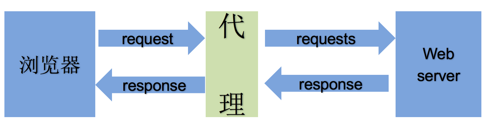
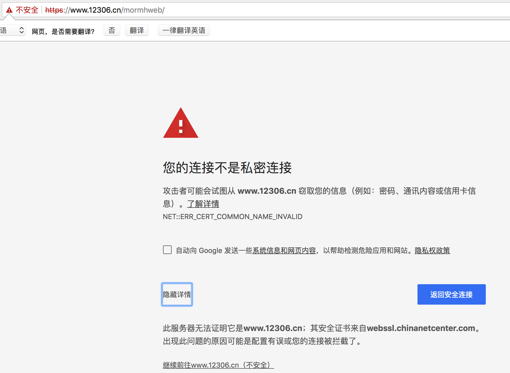

   * [网络请求模块](#网络请求模块)
      * [requests](#requests)
         * [介绍](#介绍)
         * [学习资料](#学习资料)
      * [requests模块的安装](#requests模块的安装)
         * [requests模块的使用](#requests模块的使用)
            * [基本使用](#基本使用)
            * [自定义请求头](#自定义请求头)
            * [发送 GET 请求](#发送-get-请求)
            * [发送 POST 请求](#发送-post-请求)
            * [使用代理服务器](#使用代理服务器)
            * [发送请求携带 Cookies](#发送请求携带-cookies)
            * [错误证书处理](#错误证书处理)
            * [超时处理](#超时处理)
            * [重试处理](#重试处理)
      * [urllib2](#urllib2)
         * [使用流程](#使用流程)
      * [urllib](#urllib)
         * [urllib使用注意事项](#urllib使用注意事项)
      
# 网络请求模块
## requests
### 介绍
> ``requests`` 模块是可以模仿浏览器发送请求获取响应
> ``requests`` 模块在python2,与python3中通用
> ``requests``模块能够自动帮助我们解压网页内容

### 学习资料
[中文文档](http://docs.python-requests.org/zh_CN/latest/index.html)

## requests模块的安装
> pip install requests
> 
> 如果你本地有python2,和python3两个环境，你想装在python3中，建议使用下面这种方式安装

> pip3 install requests

### requests模块的使用
#### 基本使用
- 使用方式

```
# 导入模块
import requests
# 定义请求地址
url = 'http://www.baidu.com'
# 发送 GET 请求获取响应
response = requests.get(url)
# 获取响应的 html 内容
html = response.text
```

- 代码讲解
- response 常用属性
	- response.text 返回响应内容，响应内容为 str 类型
	- respones.content 返回响应内容,响应内容为 bytes 类型
	- response.status_code 返回响应状态码
	- response.request.headers 返回请求头
	- response.headers 返回响应头
	- response.cookies 返回响应的 RequestsCookieJar 对象
- response.content 转换 str 类型

```
# 获取字节数据
content = response.content
# 转换成字符串类型
html = content.decode('utf-8')
```

- response.cookies 操作

```
# 返回 RequestsCookieJar 对象
cookies = response.cookies
# RequestsCookieJar 转 dict
requests.utils.dict_from_cookiejar(cookies)
# dict 转 RequestsCookieJar
requests.utils.cookiejar_from_dict()
# 对cookie进行操作,把一个字典添加到cookiejar中
requests.utils.add_dict_to_cookiejar()
```

#### 自定义请求头
- 使用方式

```
# 导入模块
import requests
# 定义请求地址
url = 'http://www.baidu.com'
# 定义自定义请求头
headers = {
  "User-Agent":"Mozilla/5.0 (Macintosh; Intel Mac OS X 10_14_0) AppleWebKit/537.36 (KHTML, like Gecko) Chrome/71.0.3578.98 Safari/537.36"
}
# 发送自定义请求头
response = requests.get(url,headers=headers)
# 获取响应的 html 内容
html = response.text
```

- 代码讲解
> 发送请求时添加 headers 参数作为自定义请求头

#### 发送 GET 请求
- 使用方式

```
# 导入模块
import requests
# 定义请求地址
url = 'http://www.baidu.com/s'
# 定义自定义请求头
headers = {
  "User-Agent":"Mozilla/5.0 (Macintosh; Intel Mac OS X 10_14_0) AppleWebKit/537.36 (KHTML, like Gecko) Chrome/71.0.3578.98 Safari/537.36"
}
# 定义 GET 请求参数
params = {
  "kw":"hello"
}
# 使用 GET 请求参数发送请求
response = requests.get(url,headers=headers,params=params)
# 获取响应的 html 内容
html = response.text
```

- 代码讲解
> 发送请求时 params 参数作为 GET 请求参数

#### 发送 POST 请求
- 使用方式

```
# 导入模块
import requests
# 定义请求地址
url = 'http://www.baidu.com'
# 定义自定义请求头
headers = {
  "User-Agent":"Mozilla/5.0 (Macintosh; Intel Mac OS X 10_14_0) AppleWebKit/537.36 (KHTML, like Gecko) Chrome/71.0.3578.98 Safari/537.36"
}
# 定义post请求参数
data = {
  "kw":"hello"
}

# 使用 POST 请求参数发送请求
response = requests.post(url,headers=headers,data=data)
# 获取响应的 html 内容
html = response.text
```

- 代码讲解
> 发送请求时 data 参数作为 POST 请求参数

####保存图片
- 使用方式

```
# 导入模块
import requests
# 下载图片地址
url = "http://docs.python-requests.org/zh_CN/latest/_static/requests-sidebar.png"
# 发送请求获取响应
response = requests.get(url)
# 保存图片
with open('image.png','wb') as f:
  f.write(response.content)
``` 

- 代码讲解

> 保存图片时后缀名和请求的后缀名一致
> 
> 保存必须使用 response.content 进行保存文件


#### 使用代理服务器
- 作用
	- 让服务器以为不是同一个客户端在请求
	- 防止我们的真实地址被泄露，防止被追究
- 使用代理的过程



- 代理分类
- 透明代理(Transparent Proxy)：透明代理虽然可以直接“隐藏”你的IP地址，但是还是可以查到你是谁。
- 匿名代理(Anonymous Proxy)：匿名代理比透明代理进步了一点：别人只能知道你用了代理，无法知道你是谁。
- 混淆代理(Distorting Proxies)：与匿名代理相同，如果使用了混淆代理，别人还是能知道你在用代理，但是会得到一个假的IP地址，伪装的更逼真
- 高匿代理(Elite proxy或High Anonymity Proxy)：可以看出来，高匿代理让别人根本无法发现你是在用代理，所以是最好的选择。
> 在使用的使用，毫无疑问使用高匿代理效果最好
> 
> 从使用的协议：代理ip可以分为http代理，https代理，socket代理等，使用的时候需要根据抓取网站的协议来选择

- 使用方式

```python
# 导入模块
import requests
# 定义请求地址
url = 'http://www.baidu.com'
# 定义自定义请求头
headers = {
  "User-Agent":"Mozilla/5.0 (Macintosh; Intel Mac OS X 10_14_0) AppleWebKit/537.36 (KHTML, like Gecko) Chrome/71.0.3578.98 Safari/537.36"
}
# 定义 代理服务器
proxies = {
  "http":"http://IP地址:端口号",
  "https":"https://IP地址:端口号"
}
# 使用 POST 请求参数发送请求
response = requests.get(url,headers=headers,proxies=proxies)
# 获取响应的 html 内容
html = response.text
```

- 代码讲解

> 发送请求时 proxies 参数设置代理

#### 发送请求携带 Cookies
- 使用方式


> 直接在自定义请求头中携带 Cookie
> 
> 通过请求参数携带 Cookie 对象

- 代码

```python
# 导入模块
import requests
# 定义请求地址
url = 'http://www.baidu.com'
# 定义自定义请求头
headers = {
  "User-Agent":"Mozilla/5.0 (Macintosh; Intel Mac OS X 10_14_0) AppleWebKit/537.36 (KHTML, like Gecko) Chrome/71.0.3578.98 Safari/537.36"
  # 方式一：直接在请求头中携带Cookie内容
  "Cookie": "Cookie值"
}
# 方式二：定义 cookies 值
cookies = {
  "xx":"yy"
}
# 使用 POST 请求参数发送请求
response = requests.get(url,headers=headers,cookies=cookies)
# 获取响应的 html 内容
html = response.text
```

- 代码讲解

> 发送请求时 cookies 参数携带 Cookies

#### 错误证书处理
- 问题描述


- 使用方式

```python
# 导入模块
import requests

url = "https://www.12306.cn/mormhweb/"
# 设置忽略证书
response = requests.get(url,verify=False)
```

- 代码讲解


> 发送请求时 verify 参数设置为 False 表示不验证CA证书

#### 超时处理
- 使用方式

```python
# 导入模块
import requests

url = "https://www.baidu.com"
# 设置忽略证书
response = requests.get(url,timeout=5)
```

- 代码讲解


> 发送请求时 timeout 参数设置为超时秒数

#### 重试处理
- 使用方式

```python
#!/usr/bin/python3
# -*- coding: utf-8 -*-
'''
可以使用第三方模块 retrying 模块
1. pip install retrying

'''
import requests
# 1. 导入模块
from retrying import retry

# 2. 使用装饰器进行重试设置
# stop_max_attempt_number 表示重试次数
@retry(stop_max_attempt_number=3)
def parse_url(url):
    print("访问url:",url)
    headers = {
        "User-Agent":"Mozilla/5.0 (Macintosh; Intel Mac OS X 10_14_0) AppleWebKit/537.36 (KHTML, like Gecko) Chrome/70.0.3538.110 Safari/537.36"
    }
    proxies = {
        "http":"http://124.235.135.210:80"
    }
    # 设置超时参数
    response = requests.get(url,headers=headers,proxies=proxies,timeout=5)
    return response.text

if __name__ == '__main__':
    url = "http://www.baidu.com"
    try:
        html = parse_url(url)
        print(html)
    except Exception as e:
        # 把 url 记录到日志文件中，未来进行手动分析，然后对url进行重新请求
        print(e)
        
```

- 代码讲解
安装 ``retrying`` 模块

> retrying 模块可以通过装饰器模式对某个函数进行监控，如果该函数引发异常就会触发重试操作

> pip install retrying

- 对需要重试的函数进行装饰器设置

> 通过 ``@retry(stop_max_attempt_number=重试次数)`` 参数设置重试次数

```python
# 1. 导入模块
from retrying import retry
# 2. 装饰器设置重试函数
@retry(stop_max_attempt_number=3)
def exec_func():
    pass
``` 
    
    

## urllib2
> 在python2 中使用urllib2网络库

### 使用流程
1. 导入urllib2模块
2. 发起请求获取响应数据
	1. 定义请求地址
	2. 自定义请求头
	3. 自定义请求对象
	4. 发送请求
3. 处理响应内容

```python2
#!/usr/bin/python2
# -*- coding: utf-8 -*-
#1. 导入urllib2模块
import urllib2
#2. 发起请求获取响应数据
#2.1. 定义请求地址
url = "https://github.com"
#2.2. 自定义请求头
headers = {
    "User-Agent": "Mozilla/5.0 (Macintosh; Intel Mac OS X 10_14_3) AppleWebKit/537.36 (KHTML, like Gecko) Chrome/73.0.3683.86 Safari/537.36",
    "Referer": "https://github.com/",
    "Host": "github.com"
}
#2.3. 自定义请求对象
req = urllib2.Request(
    url=url,
    headers=headers
)
#2.4. 发送请求
resp = urllib2.urlopen(req)
#3. 处理响应内容
with open("text.txt", "wb") as f:
	f.write(resp.read())


```

## urllib
> python3 中使用urllib网络库

```python3
#!/usr/bin/python3
# -*- coding: utf-8 -*-
import urllib.request

# 2. 发起网络请求
# 2.1. 定义请求地址
url = "https://github.com"
# 2.2. 自定义请求头
headers = {
    "User-Agent": "Mozilla/5.0 (Macintosh; Intel Mac OS X 10_14_3) AppleWebKit/537.36 (KHTML, like Gecko) Chrome/73.0.3683.86 Safari/537.36",
    "Referer": "https://github.com/",
    "Host": "github.com"
}

# 定义请求对象
req = urllib.request.Request(
    url=url,
    headers=headers
)

# 发送请求
resp = urllib.request.urlopen(req)

# 处理响应
with open('github.txt', 'wb') as f:
    f.write(resp.read())
```

### urllib使用注意事项
- 如果使用在URL中需要进行转义

```python3
 #!/usr/bin/python3
 # -*- coding: utf-8 -*-

 # 1. 导入模块
 import urllib.request
 import urllib.parse

 # 2. 发起请求获取响应

 wd = input("请输入查询内容：")

 # 2.1 定义请求地址
 url = "https://www.baidu.com/s?wd="
 # 2.2 定义自定义请求头
headers = {
    "User-Agent": "Mozilla/5.0 (Macintosh; Intel Mac OS X 10_14_3) AppleWebKit/537.36 (KHTML, like Gecko) Chrome/73.0.3683.86 Safari/537.36",
    "Referer": "https://github.com/",
    "Host": "github.com"
}
 # 2.3 定义请求对象
 request = urllib.request.Request(
     url=url + urllib.parse.quote(wd),
     headers=headers
 )
 # 2.4 发送请求
 response = urllib.request.urlopen(request)

 # 3. 处理响应
 with open('02.html','wb') as f:
     f.write(response.read())
response.read() 
```
- 返回值是字节串，获取字符串内容需要进行 decode

```python3
 html = response.read().decode('utf-8')
```
 
 
