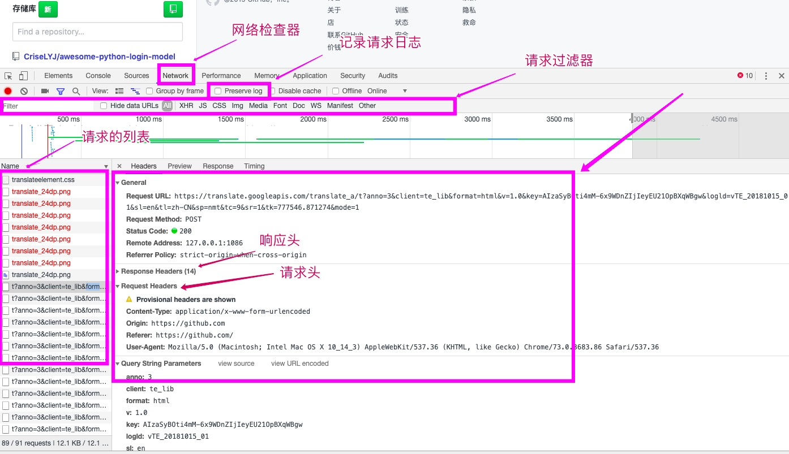
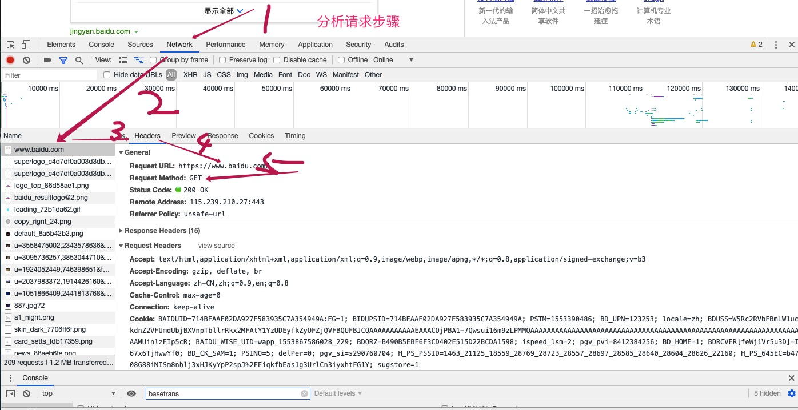

  * [请求分析](#请求分析)
    * [chrome调试面板的使用](#chrome调试面板的使用)
    * [请求分析的流程图](#请求分析的流程图)

# 请求分析
## chrome调试面板的使用

## 请求分析的流程图

1. 寻找指定的url
2. 确定请求的方式
3. 获取到请求的参数
4. 获取请求头

- 请求头使用
> 模拟请求时，先在headers中加入``User-Agent``,如果还不可以请求再尝试加入``Referer``,还无法访问，在尝试加入``Cookie``,在最后可以尝试加入``Host``.
